# ArcadeIPL 🕹️

Loads the Arcade interior into FiveM. Requires gamebuild 2189 or higher

# Coordinates 🔎

X 2737.96, Y -374.12, Z -47.99

**This does not include teleporters and / or doorlocks. That is your responsibility.**

 Alternativelty, you can use [Online Interiors](https://github.com/TayMcKenzieNZ/online-interiors)

# Screenshots

| | | |
|-|-|-|
| 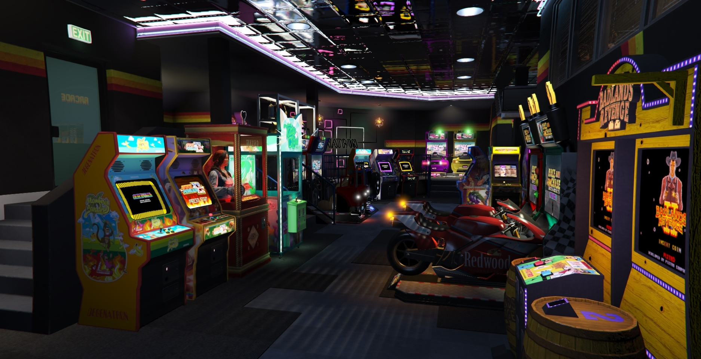 | 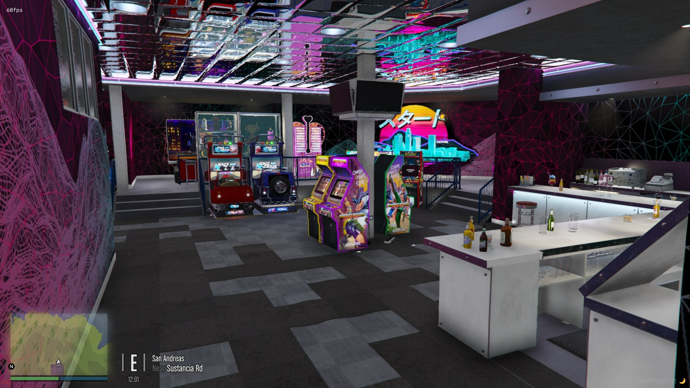 | 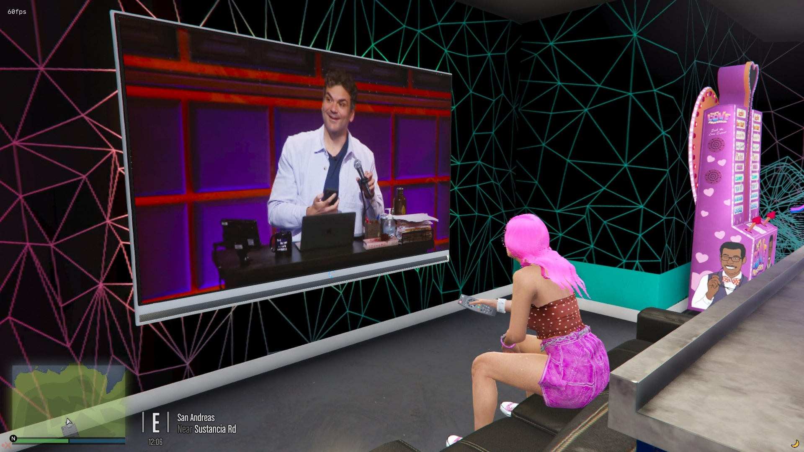 |
| 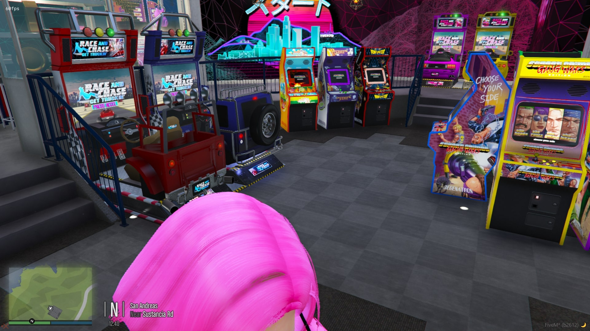 | 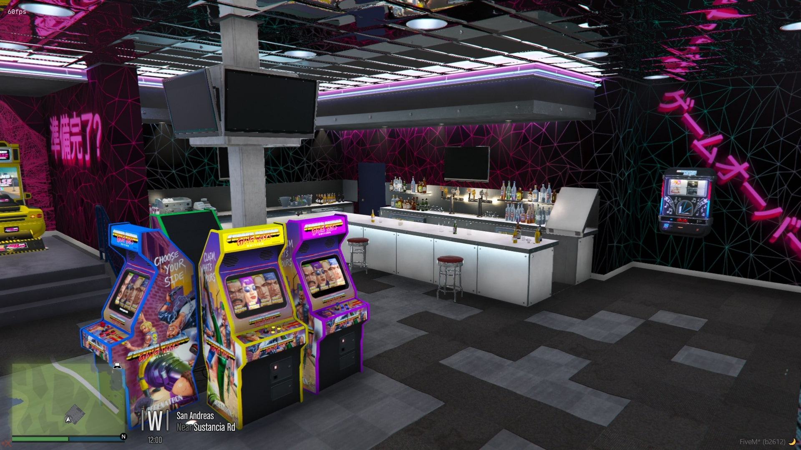 | 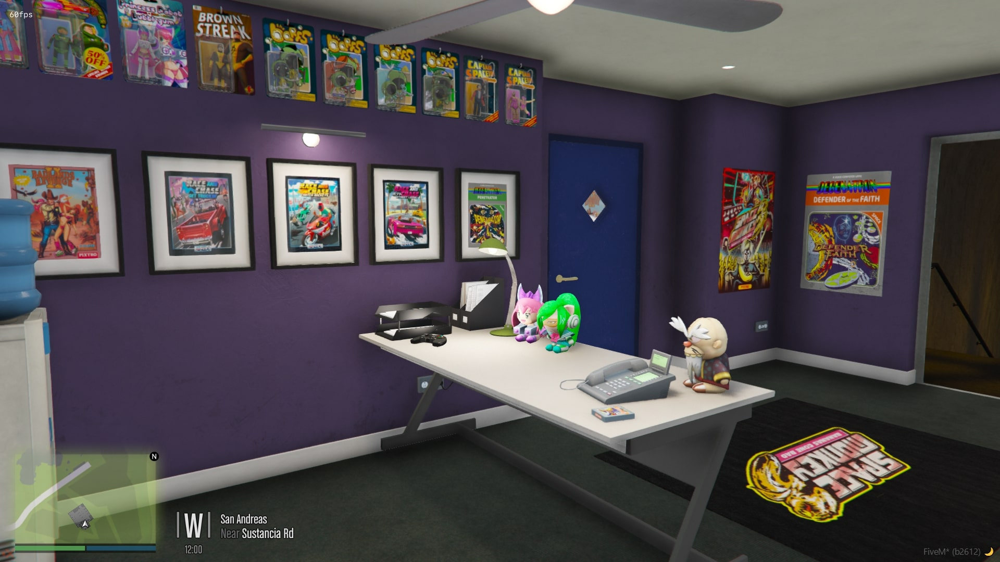 |
| 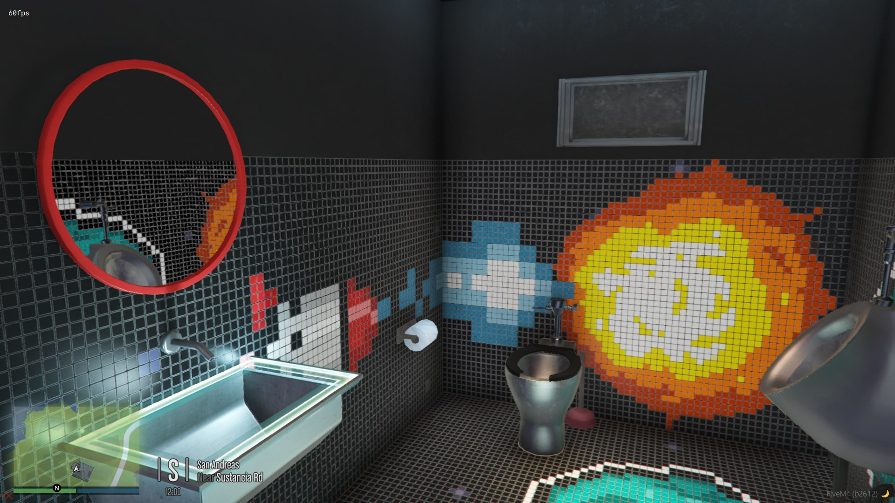 | 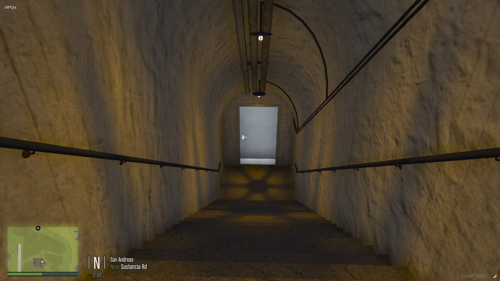 | 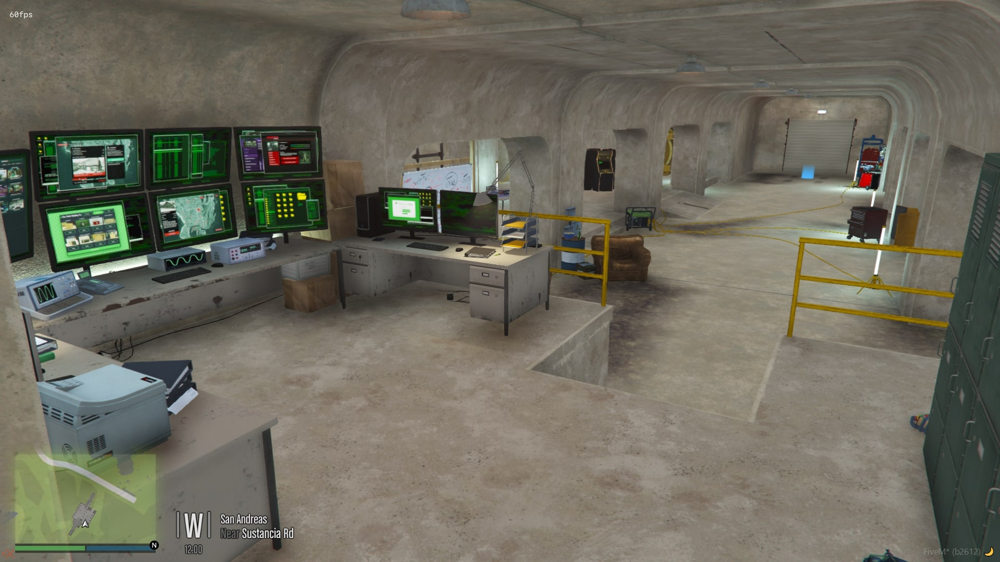 |
| 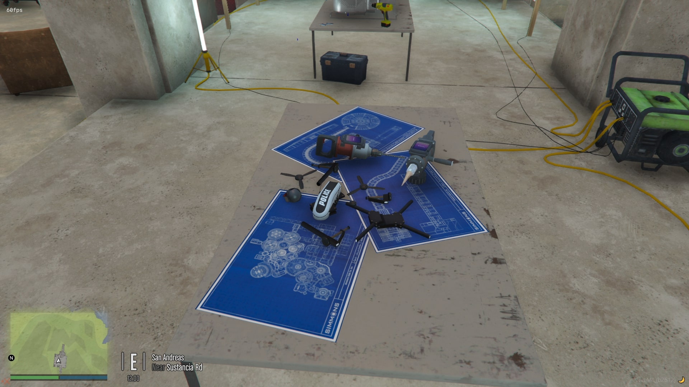 | 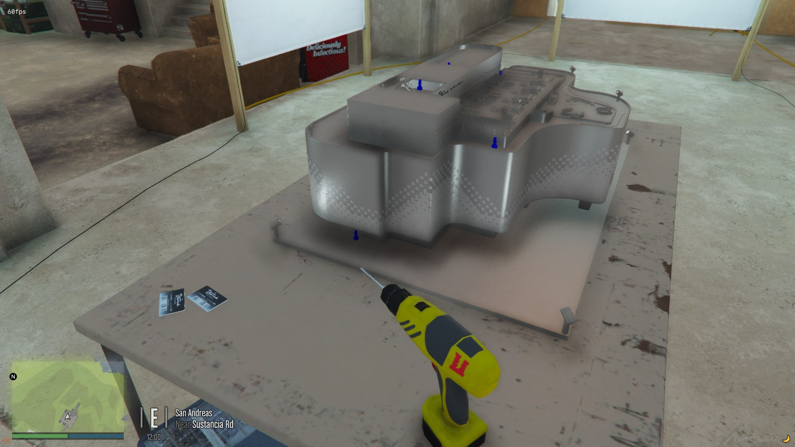 |

---------------------------------------

# Installing

1. Extract `ArcadeIPL` folder and add add to your resources folder.

2. Add `start ArcadeIPL` to your server.cfg

3. Enjoy

---------------------------------------

# License 

This repository does not contain a license, therefore you are not allowed to add one and claim it as yours.

**You are not allowed to sell this however you may add to** [bob74_ipl](https://github.com/Bob74/bob74_ipl) **or any other IPL resource**

You are not allowed to change/add a license.

Pull requests are accepted as long as they do not contain breaking changes. 

You can read more here [HERE](https://opensource.stackexchange.com/questions/1720/what-can-i-assume-if-a-publicly-published-project-has-no-license)
